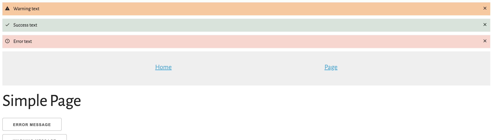

import {Header} from '../../components/Header';

<Header
    developerId={2}
    projectGit={'https://github.com/UlyanaKiklevich/redux-global-messages'}
/>

</img>

<strong>Prerequisites:</strong> deployed, working react app

<p>
Я столкнулась с потребностью сделать глобальные error/success/warning сообщения для всего сайта.
Идея заключалась в том, чтобы Page-Message Component добавлялся на страницу один раз, в Root, но все child-компоненты имели к нему доступ и могли добавлять и удалять сообщения.
Для осуществления задумки было принято решение использовать модель Redux.
Package.json со всеми зависимостями можно будет найти в гит-репозитории, указанном ниже.
</p>

<p>
Начнем с создания глобального хранилища наших сообщений - store. В initialState инициализируем объект с полем messages - пустой массив (line 4).
Создаем Reducer. Прописываем следующие action’ы: добавить сообщение (line 9), удалить все сообщения (line 12), удалить конкретное сообщение (line 15).
Чтобы идентифицировать сообщения, при добавлении его в массив генерируем уникальный _id (line 10).

Создаем store. (line 23)
</p>

```jsx:title=src/components/base/store.js {4,9-10,12,15,23}
import {createStore} from 'redux';

const initialState = {
    messages: []
};

function messagesReducer(state = initialState, action) {
    switch (action.type) {
        case "addMessage":
            state.messages.push({...action.payload, _id: '_' + Math.random().toString(36).substr(2, 9)})
            return {...state}
        case "clearMessages":
            state.messages = [];
            return {...state};
        case "hideMessage":
            state.messages = state.messages.filter(message => message._id !== action.payload._id);
            return {...state};
        default:
            return state;
    }
}

export const store = createStore(messagesReducer);
```
<p>
Дальше, создадим high-order-component, чтобы из всех компонентов можно было быстро и эффективно оперировать массивом сообщений.
Наш кошмпонент возвращает объект с тремя функциями. Каждая из функция триггерит событие, попадающее в messageReducer из файла <code>src/components/base/store.js</code>.
</p>

```jsx:title=src/components/hoc/useMessage.js {4,8,12}
import {store} from '../base';

export function useMessage() {
    const addMessage = (data) => {
        store.dispatch({type: 'addMessage', payload: data})
    };

    const clearMessages = () => {
        store.dispatch({type: 'clearMessages'})
    }

    const hideMessage = (_id) => {
        store.dispatch({type: 'hideMessage', payload: {_id}})
    }

    return {addMessage, clearMessages, hideMessage};
}

```

<p>
Moving forward to the view-part.
У нас будет один контейнер - MessagesContainer, который будет выводить массив всех сообщений, отрендернных компонентом Message.
Чтобы обновлять компонент по мере обновление массива сообщений, необходимо сделать 2 вещи: сделать локальные messages - состоянием state (line 6), и подписаться на обновление  массива сообщений в главном хранилище - store (line 8).
Чтобы страничка скроллилась наверх при появлении новых сообщений - я дописала window.scrollTo(0,0);
</p>

```jsx:title=src/components/base/MessagesContainer.js {6,8}

import React, {useState} from 'react';
import './styles/Message.css';
import {Message, store} from './';

export const MessagesContainer = () => {
    const [messages, setMessages] = useState([]);

    store.subscribe(() => {
        setMessages([...store.getState().messages]);
        window.scrollTo(0, 0);
    });

    return (
        <div className={'message-container'}>
            {messages.map((message, index) =>
                <Message key={index} message={message} />)}
        </div>
    )
}
```
<p>
Далее приступим к непосредственно созданию компонента Message. Иконки экспортируем из библиотеки <code>@material-ui/icons</code>.
Текст и иконка сообщения будет зависеть от переданного message code.
</p>

```jsx:title=src/components/base/Message.js {5-7,10}
import DoneIcon from '@material-ui/icons/Done';
import ErrorOutlineIcon from '@material-ui/icons/ErrorOutline';
import WarningIcon from '@material-ui/icons/Warning';
import ClearIcon from '@material-ui/icons/Clear';
import {useMessage} from "../hoc/useMessage";
import './styles/Message.css';

export const Message = (props) => {
    const {_id, messageCode, text} = props.message;
    const {hideMessage} = useMessage();

    let className = 'page-message ';
    let icon = <DoneIcon/>;

    switch (messageCode) {
        case 'error':
            className += 'error';
            icon = <ErrorOutlineIcon/>;
            break;
        case 'warning':
            className += 'warning';
            icon = <WarningIcon/>;
            break;
        case 'success':
            className += 'success';
            icon = <DoneIcon/>;
            break;
        default:
            className += 'error';
            icon = <ErrorOutlineIcon/>;
            break;
    }

    return (
        <div className={className}>
            <span className={'icon message-icon'}>
                {icon}
            </span>
            {text}
            <span className={'icon clear-icon'} onClick={hideMessage.bind(this, _id)}>
                <ClearIcon/>
            </span>
        </div>
    )
}
```

<p>
Дальше обращаемся к компоненту Root.
    <p>
        1) Импортируем <code>Provider</code> from <code>'react-redux'</code> - line 5. В этот компонент нам нужно будет обернуть всю нашу страницу - line 53.
    </p>
    <p>
        2) Сделаем так, чтобы при изменении локации на сайте сообщения очищались. Для этого имортируем hoc <code>withRouter</code> from <code>'react-router-dom'</code>. - line 4. Затем сосздадим непосредственно компонент <code>Location</code> - line 19. Crucial this was to add this <code>Location</code> component inside the <code>Router</code> component. line 31
    </p>
    <p>
        3) При апдейте локации будет срабатывать функция <code>clearMessages</code> - line 22.
    </p>
</p>

```jsx:title=src/index.js {5,19,22,31,53}
// React essential components
import React, {useEffect} from 'react';
import ReactDOM from 'react-dom';
import {BrowserRouter as Router, Link, Route, Switch, withRouter} from "react-router-dom";
import {Provider} from 'react-redux';

// Pages
import {AnotherPage, Home} from './components/pages';

// Messages components
import {MessagesContainer, store} from "./components/base";
import {useMessage} from "./components/hoc/useMessage";

// Base styles
import './styles/base.css';


// Handler for location change: clear messages when moving to another page
const Location = withRouter(({history}) => {
    const {clearMessages} = useMessage();

    useEffect(() => history.listen(clearMessages))

    return '';
});

// Base navigation
const Routing = () => {
    return (
        <Router>
            <Location/>
            <nav>
                <ul>
                    <li>
                        <Link to={'/'}>Home</Link>
                    </li>
                    <li>
                        <Link to={'/page'}>Page</Link>
                    </li>
                </ul>
            </nav>
            <Switch>
                <Route path={'/'} exact component={Home}/>
                <Route path={'/page'} component={AnotherPage}/>
            </Switch>
        </Router>
    )
};

// Root
ReactDOM.render(
    <React.StrictMode>
        <Provider store={store}>
            <MessagesContainer/>
            <Routing/>
        </Provider>
    </React.StrictMode>,
    document.getElementById('root')
);

```

Fot tests, I'm creating buttons that generate errors.
```jsx:title=src/components/pages/AnotherPage.js
import {useMessage} from "../hoc/useMessage";
import './styles/Page.css';

export const AnotherPage = () => {
    const {addMessage, clearMessages} = useMessage();

    return (
        <>
            <h1>Simple Page</h1>
            <button onClick={() => {
                addMessage({messageCode: 'error', text: 'Error text'})
            }}>error message
            </button>
            <button onClick={() => {
                addMessage({messageCode: 'warning', text: 'Warning text'})
            }}>warning message
            </button>
            <button onClick={() => {
                addMessage({messageCode: 'success', text: 'Success text'})
            }}>success message
            </button>
            <button onClick={() => {
                clearMessages()
            }}>Clear
            </button>
        </>
    )
}
```

Everything works fine for me. Could you please check and let me know? :)